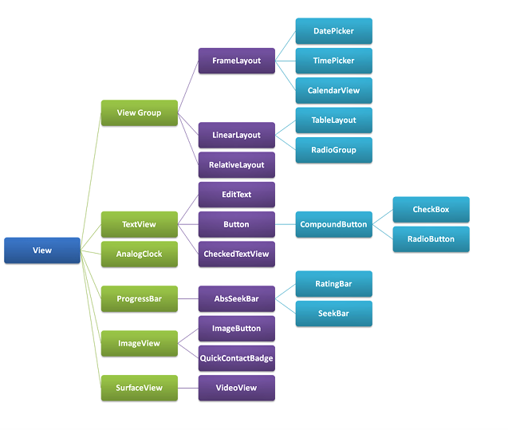
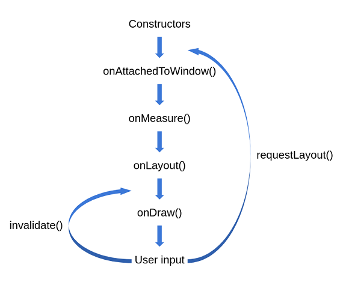

# Custom view

[источник](https://habr.com/ru/articles/727744/#Способы%20создания%20Custom%20View.)

Зачем вообще надо?
Если вдруг нам нужно что-то уникальное, чего нет в библиотеках

К примеру какой-то супер календарь с изображением статистики или графиками.

Для создания нужно создать класс-наследник от View()

```kotlin
class TestView(
    context: Context, attributeSet: AttributeSet
) : View(context, attributeSet) {
    override fun onDraw(canvas: Canvas) {
        super.onDraw(canvas)
        // прорисовка элемента
        canvas.drawCircle(width / 2f, height / 2f, radius, paint)
    }
}
```

## Иерархия view


## Жизнь view 


**1. Метод onAttachToWindow()**
После вызова данного метода, наша View прикрепляется к нашему Activity и знает о других элементах, которые также находятся на этом экране.

**2. Метод onMeasure()**
Конечная цель метода onMeasure() — определить размер и расположение вашего View на экране. В качестве параметров он принимает две переменные widthMeasureSpec и heightMeasureSpec, которые в свою очередь представляют собой требования измерения ширины и высоты вашего View. При переопределении данного метода, необходимо указать ширину и высоту вашего View самостоятельно, используя метод setMeasuredDimension().

**3. Метод onLayout()**
Метод onLayout() вызывается при каждом изменении размера и позиции View, в том числе при его создании и перерисовке. Обычно этот метод переопределяется в Custom View только в том случае, когда в нем есть дочерние View, которые нужно разместить в определенном порядке.

**4. Метод onDraw()**
Основной метод при разработке собственной View. При переопределении метода onDraw() используется объект Canvas (2D-холст), на котором можно рисовать графические элементы. Также в этом методе можно использовать объекты Paint и Path, которые определяют стиль и форму рисуемых элементов.

- **Canvas**
Canvas предоставляет нам методы для рисования фигур, линий, текста и других элементов на экране, например:

    + **drawColor**(color: Int) — заливает всю область цветом, указанным в аргументе.

    + **drawLine**(startX: Float, startY: Float, stopX: Float, stopY: Float, paint: Paint) — рисует линию, заданную двумя точками.

    + **drawRect**(left: Float, top: Float, right: Float, bottom: Float, paint: Paint) — рисует прямоугольник, заданный координатами левого верхнего и правого нижнего углов.

    + **drawCircle**(cx: Float, cy: Float, radius: Float, paint: Paint) — рисует круг, заданный координатами центра и радиусом.

    + **drawText**(text: String, x: Float, y: Float, paint: Paint) — рисует текст, заданный строкой и координатами базовой точки.
- **Paint**
Объект Paint представляет собой кисть, с помощью которой мы рисуем на Canvas.
Примеры методов для `val paint = Paint()`:

    + **color** (цвет рисования) — `paint.color = Color.RED`

    + **strokeWidth** (ширина линии рисования) — `paint.strokeWidth = 10f`

    + **style** (стиль рисования) — `paint.style = Paint.Style.FILL`. Принимает в качестве параметра одно из значений класса `Paint.Style: FILL`, `STROKE` или `FILL_AND_STROKE`.

    + **textSize** (размер шрифта текста) — `paint.textSize = 30f`


**5. Метод onSizeChanged()**
Метод onSizeChanged() вызывается при изменении размеров View (смена ориентация устройства, изменение размера родительского контейнера) и может быть переопределен в кастомном View для реакции на эти изменения. 

**6. Методы onSaveInstanceState() и onRestoreInstanceState()**
Методы onSaveInstanceState() и onRestoreInstanceState() позволяют сохранять и восстанавливать состояние View в случае, когда система уничтожает и пересоздает View, например, при повороте экрана или при нехватке памяти.

**7. Метод onTouchEvent()**
Метод onTouchEvent() — это один из методов обработки событий пользовательского ввода в View. Вызывается при каждом событии касания на View, например при нажатии, перемещении или отпускании пальца.

## Конструкторы view

**1. Конструктор с одним параметром — Context**
Используется только в том случае, если View мы хотим создавать из кода, а не из XML.

**2. Конструктор с двумя параметрами — Context и AttributeSet**
Используется для создания View с использованием XML-макета. В этом конструкторе можно получить значения атрибутов View, указанных в XML-разметке, и использовать их для настройки свойств вашего Custom View.

**3. Конструктор с тремя параметрами — Context, AttributeSet и defStyleAttr**
Вызывается при создании View с помощью XML-разметки и задании значения стиля (defStyleAttr) из темы.

**4. Конструктор с четырьмя параметрами — Context, AttributeSet, defStyleAttr и defStyleRes**
Также используется для создания View с использованием XML-макета, со стилем из темы и/или с ресурсом стиля.