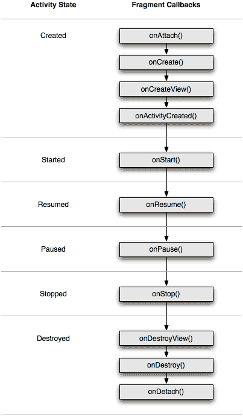

# Fragment lifecycle 

[источник](https://developer.alexanderklimov.ru/android/theory/fragment-lifecycle.php)

У фрагментов есть жизненный цикл, который во многом совпадает с жизненным циклом активности, внутри которой они находятся.

Список дополнительных методов жизненного цикла фрагментов, которых нет у активности:

- **onAttach(Activity)**
Вызывается, когда фрагмент связывается с активностью. С этого момента мы можем получить ссылку на активность через метод getActivity()
- **onCreate()**
В этом методе можно сделать работу, не связанную с интерфейсом. Например, подготовить адаптер.
- **onCreateView(LayoutInflater, ViewGroup, Bundle)**
Вызывается для создания компонентов внутри фрагмента
- **onViewCreated()**
Вызывается сразу после onCreateView()
- **onActivityCreated(Bundle)**
Вызывается, когда отработает метод активности onCreate(), а значит фрагмент может обратиться к компонентам активности
- **onStart()**
Вызывается, когда фрагмент видим для пользователя и сразу же срабатывает onStart() активности
- **onDestroyView()**
- **onResume()**
Вызываем после onResume() активности
Вызывается, когда набор компонентов удаляется из фрагмента
- **onDetach()**
Вызывается, когда фрагмент отвязывается от активности
Одноимённые с методами активности методы фрагментов выполняют аналогичные функции. К примеру, метод onResume() вызывается, когда фрагмент вновь становится видимым.

Метод onStart() вызывается, когда фрагмент становится видимым после запуска такого же метода в родительской активности.

Фрагмент всегда связан с активностью. Отдельно фрагмент от активности существовать не может.