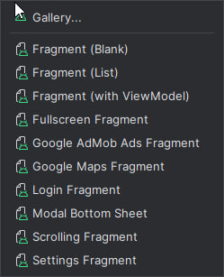

# Стандартные фрагменты

При создании нового фрагмента на момент осени 2024 года можно видеть данный список

Каждый тип фрагмента, представленный в списке, имеет свои особенности и предназначение:

1. **Fragment (Blank)** — пустой фрагмент, базовая заготовка для создания любого пользовательского интерфейса. Можно добавить элементы и логику по своему усмотрению.

2. **Fragment (List)** — фрагмент с уже настроенным списком, обычно использует `RecyclerView` для отображения данных в виде списка. Подходит для случаев, когда нужно отобразить коллекцию элементов.

3. **Fragment (with ViewModel)** — фрагмент, который интегрирован с `ViewModel`. Помогает следовать архитектуре MVVM, позволяя отделить логику от UI и эффективно управлять данными, особенно при изменениях конфигурации.

4. **Fullscreen Fragment** — фрагмент, который занимает весь экран устройства, скрывая системные элементы (например, статус-бар). Обычно используется для полноэкранных модальных окон или полноэкранных изображений/видео.

5. **Google AdMob Ads Fragment** — фрагмент, настроенный для отображения рекламы от Google AdMob. Упрощает интеграцию рекламных объявлений в приложение.

6. **Google Maps Fragment** — фрагмент с интеграцией карты Google. Подходит для приложений, где требуется отображение карт, точек интереса, маршрутов и т.п.

7. **Login Fragment** — фрагмент, предварительно настроенный для создания интерфейса авторизации. Часто содержит поля ввода для логина и пароля и кнопку для входа.

8. **Modal Bottom Sheet** — фрагмент, который отображается как модальное нижнее окно (bottom sheet), выезжающее с нижней части экрана. Обычно используется для отображения дополнительной информации или быстрых действий.

9. **Scrolling Fragment** — фрагмент, настроенный для прокрутки содержимого. Может содержать несколько элементов, которые удобно прокручивать, например, текст или изображения.

10. **Settings Fragment** — фрагмент, предназначенный для отображения настроек приложения. Обычно использует `PreferenceScreen` для создания интерфейса настроек.