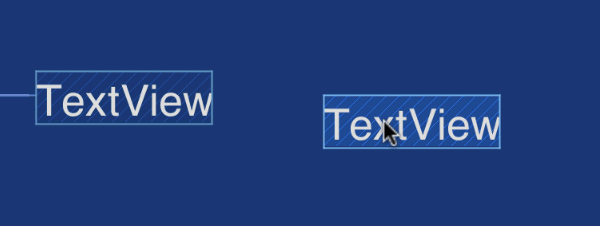

# ConstraintLayout

[источник](https://developer.alexanderklimov.ru/android/layout/constraintlayout.php)

`ConstraintLayout` является наследником `ViewGroup` и местами похож на `RelativeLayout`, но более продвинут. Код разметки в XML-представлении:

```xml
<?xml version="1.0" encoding="utf-8"?>
<android.support.constraint.ConstraintLayout 
    xmlns:android="http://schemas.android.com/apk/res/android"
    xmlns:app="http://schemas.android.com/apk/res-auto"
    xmlns:tools="http://schemas.android.com/tools"
    android:id="@+id/activity_main"
    android:layout_width="match_parent"
    android:layout_height="match_parent"
    tools:context="ru.alexanderklimov.as22.MainActivity">

    <TextView
        android:id="@+id/textView"
        android:layout_width="wrap_content"
        android:layout_height="wrap_content"
        android:layout_marginTop="16dp"
        android:text="Hello World!"
        app:layout_constraintLeft_toLeftOf="parent"
        app:layout_constraintRight_toRightOf="parent"
        app:layout_constraintTop_toTopOf="parent"
        tools:layout_constraintLeft_creator="1"
        tools:layout_constraintRight_creator="1" />

</android.support.constraint.ConstraintLayout>
```

В основном используется для создания xml разметки в редакторе

Есть полезная функция выравнивания
