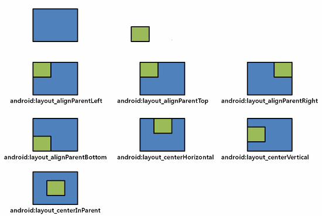
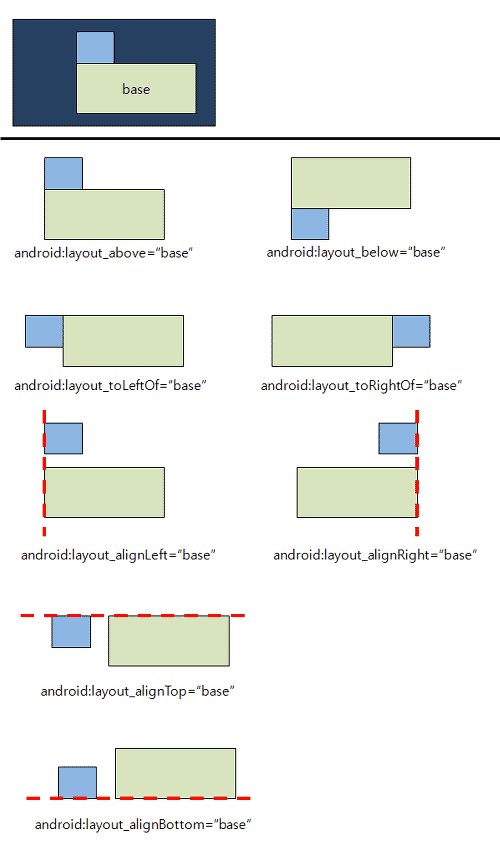

# RelativeLayout

ReiativeLayout (относительная разметка) находится в разделе Layouts и позволяет дочерним компонентам определять свою позицию относительно родительского компонента или относительно соседних дочерних элементов (по идентификатору элемента). В RelativeLayout дочерние элементы расположены так, что если первый элемент расположен по центру экрана, другие элементы, выровненные относительно первого элемента, будут выровнены относительно центра экрана. 

Атрибуты

Компонент можно размещать не только относительно родителя, но и относительно других компонентов. Для этого все компоненты должны иметь свой идентификатор, по которому их можно будет отличать друг от друга. В этом случае вы можете задействовать другие атрибуты.

