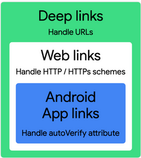
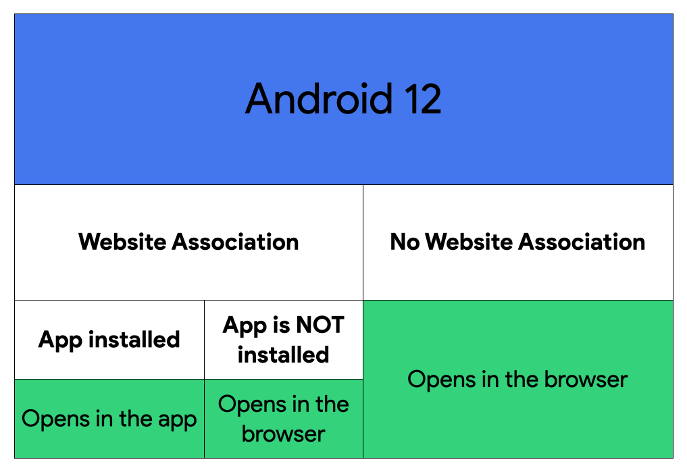
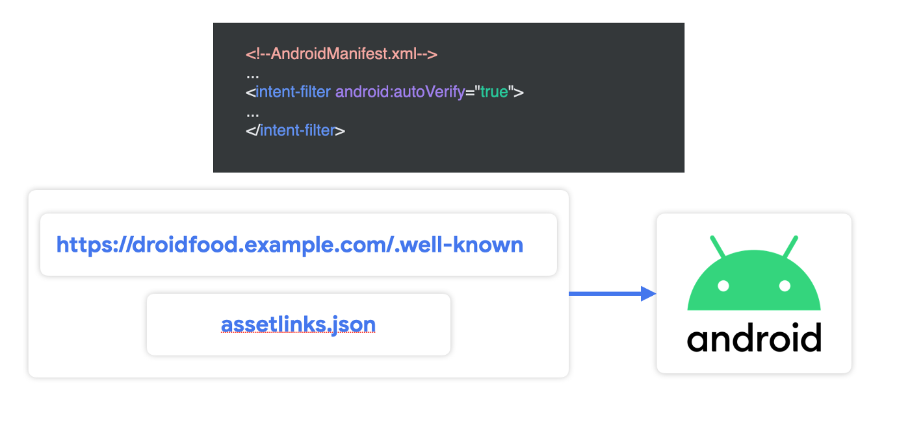

# Deep links 

>[источник](https://habr.com/ru/companies/otus/articles/688728/)
также более подробно об этом можно [узнать здесь](https://habr.com/ru/companies/otus/articles/689452/)

Это URL в полном понимании, ссылки в браузере, ссылки на приложения являются диплинками

Пример 

>https://droidfood.example.com/locations
>droidfood://near-me

Начиная с Android 12, все веблинки по умолчанию открываются в браузере, если только не настроена ассоциация между вашим сайтом и приложением Android. Такая ассоциация является основой для Android-эпплинков.

Для того, чтоб можно было переходить с сайта в приложение, нужно объявить ассоциацию

Как упоминалось выше, в рамках дополнительной конфигурации от нас требуется следующее:

- **Атрибут autoVerify**, установленный в значение true в фильтре интентов вашего приложения. Он позволяет вашему приложению быть обработчиком по умолчанию для данного типа ссылки.

- **Объявить ассоциацию**. Должна быть создана ассоциация между страницей на вашем сайте и вашим Android-приложением. Она представляет из себя JSON-файл с именем “assetlinks.json”, который должен находится в публичном доступе в каталоге “.well-known” в корневом каталоге вашего сайта.

Кроме того, стоит отметить, что вы должны позаботиться о том, чтобы ваш сайт обрабатывал эту ссылку, чтобы пользователи без вашего приложения тоже оказывались на корректной странице.

## Несколько замечаний касательно безопасности
### Верификация Android-эпплинка

До Android 12, если у вас есть ссылка, которая не прошла верификацию, диалоговое окно устранения неоднозначности появлялось для всех ваших ссылок. Это означает, что другие приложения могут добавлять такие ссылки в свой манифест, делая ваших пользователей потенциально подверженными риску.

Как верефицировать описано [здесь](https://developer.android.com/training/app-links/verify-site-associations)