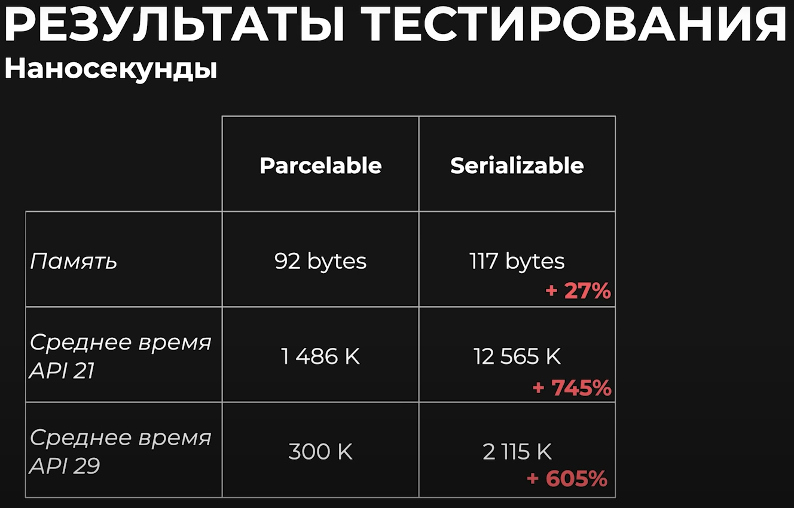

# Serialization

**Сериализация** - процесс перевода структуры данных (объкета, класса, набора элементов), в последовательность байтов.

**Десериализация** - обратный сериализации процесс 

Занимает довольно болльшое время, так как создяется большое количество объектов

Можно хранить на диске

Желательно всегда указывать Serial Version UID, если мы храним объект где-то, так как в случае изменения класса, каких-то методов обработки на стороне Java или Kotlin, мы можем этот объект больше не получить обратно в том же виде

# Parcel

Работает как стэк данных
Не зависит от имени переменных, так как укладывает их в нужном порядке

Не используется для хранения на хард диске, так как предназначен для работы между процессов, под что и оптимизирован 

### Минусы
- От рефлексии все равно не избавились 

---
### Почему не вынести Serialization на внешний поток?

**Все межпроцессные** операции происходят на главном потоке
В этом заключается проболема оптимизации 

Сравнение скорости чтения записи в [ролике здесь тык](https://www.youtube.com/watch?v=tko54cjc79U)
