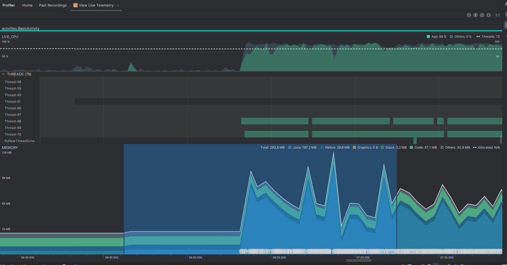

# Garbage Collector
или по простому **GC**

[источник](https://www.geeksforgeeks.org/android/how-garbage-collector-works-in-android/)

Служит для сбора и удаления ненужных объектов из памяти, кучи (heap) 

Вызывается в 3 случаях:
- Скоро сработает OutOfMemoryError
- Размер кучи достигает установленного мягкого ограничения  
- Явный вызов GC

В каждом случае есть спецификации: выполнение очистки параллельно работе приложения, частичная сборка (освобождение только из активной кучи), с сохранением мягких ссылок (soft references). Но при вызове из-за экстремальной нехватки памяти (перед крайним OutOfMemoryError) выполнение происходит полное и синхронное 

### Пример

Это Android Profiler, он позволяет наблюдать за используемой памятью, следить за вызовами GC

График показывает используемую ОЗУ устройства

На графике видно, что память начала резко использоваться. В коде в этот момент запустился бесконечный цикл, который создает объект и закрывается. Видно, что GC (белые корзинки внизу графика) начал интенсивно запускаться и удалять эти объекты, пока приложение не упало. 