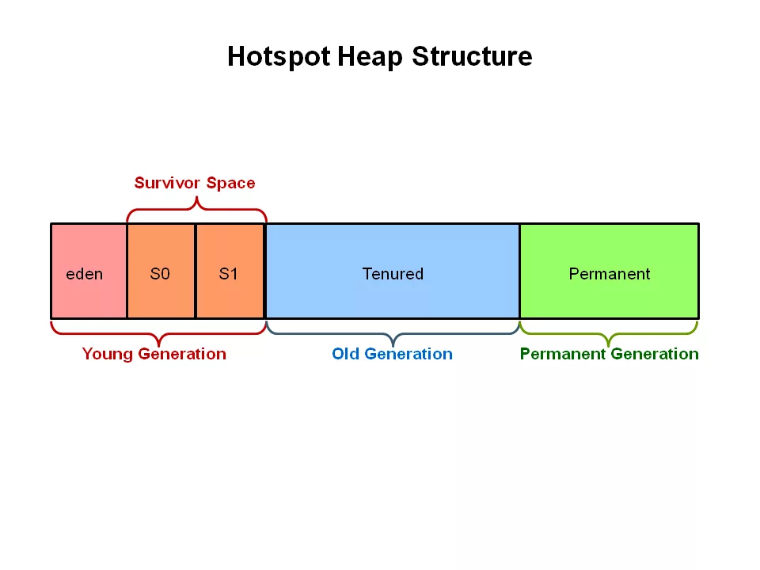

## list recently use cache

в файл подкачки отдаются те данные, которые использовались давно

## virtual machine

JVM -> Dalvik Virtual Machine -> Android Runtime

---
# zRAM

в оперативной памяти есть небольшой кусок, который работает как файл подкачки.
если нужно сохранить что-то, то в в этот кусок кладется сжатая информация, когда нужно - достается.

ест память, есть батарейку, но НЕ ест ресурс диска в телефоне (чтения - записи)

# Garbage collector

### Tracing GC (Android)

все объекты должны быть достижимы из roots (корней сборщика мусора) 

раньше была stop the world фаза

на каждое приложение (Android 9) выделялось примерно 256мб памяти, по этой причине можно было получить outOfMemoryError

##### Activity Manager

местный судья, который распределяет память между приложениями 

##### GC versions

Dalvik GC
представитель Stop The World GC

Android Runtime
работал по принципу mark and swift 
этапа два:
- mark ходит и помечает живые объекты
- swift ходит по оставшимся и собирает 

происходит в 3 случаях
- вызвали сами
- закончилась куча
- создание ошибки при создании объекта (нет памяти)

первым делом останавливает все работающие потоки, чтобы найти подмножество root 
вторым помечает объекты

Появилось понятие Generational GC (поколения проверок) 

##### Hotspot heap structure

Теперь GC анализирует только переполненную часть, что ускоряет работу
После анализа перемещает объекты в зависимости от их срока жизни в нужную категорию

В Andriod 7 команда Dalvik переписала выделение памяти на ассемблере, сделав ее всего лишь в каких-то 10 раз быстрее

##### Concurrent Mark Sweep Compact Collection algorithm (CMS)

.png)

Франментация - когда есть "дыры" в памяти, которых не хватает для записи объекта, ведь они слишком мелкие, при том что их много и они в общем составляют много свободной памяти. Дефрагментация устраняет это

Была убрана идея поколений..

И возвращена в 10 андроиде

##### Ссылки и типы в Java

Их всего 4 штуки:

- srtong reference
- soft reference будет удален, как нужна  память
- weack reference будет удален, как все ссылки на него = null
- phantom reference всегда будет возвращать null

### Reference counting GC (IOS)

ведется подсчет ссылок на объект. когда == 0, то объект удаляется
