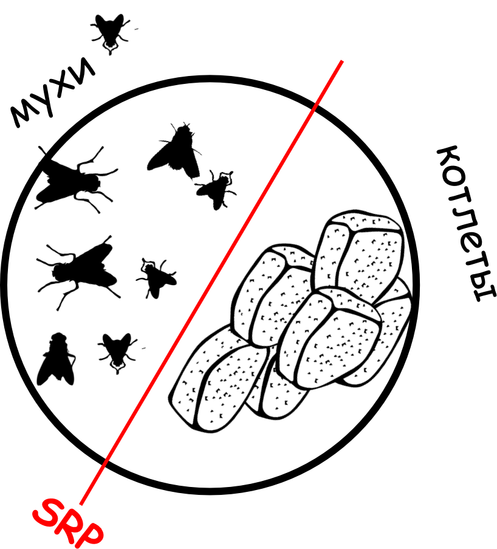

# Single responsibility principle

Принцип единой ответственности

хорошо показано на примере 
>Первое серьезное знакомство с этим принципом состоялось для меня в начале первого курса, когда молодых и зеленых нас вывезли в лес, чтобы сделать из личинок студентов — студентов настоящих.
>
>
>В лесу нас разделили на группы по 8-9 человек в каждой и устроили соревнование — какая группа быстрее выпьет бутылку водки при условии, что первый человек из группы наливает водку в стакан, второй выпивает, а третий закусывает. Выполнивший свою операцию юнит встает в конец очереди группы.
>
>
>Случай, когда размер очереди был кратен трем, и являлся хорошей реализацией SRP.

Изменения объекта\класса должно производиться только по 1 причине (так как они реализует только 1 лугику)

