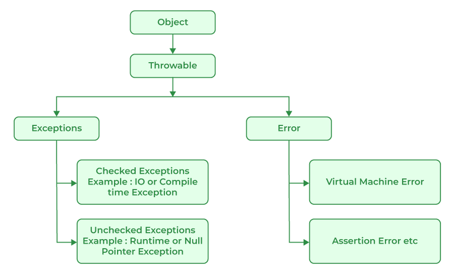
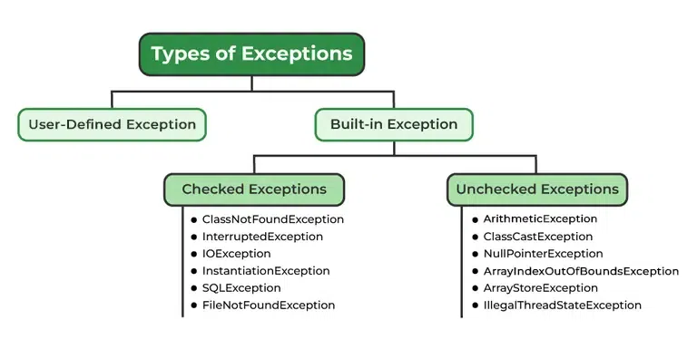

# Exceptions and Errors in Java

[источник](https://www.geeksforgeeks.org/exceptions-in-java/)

#### Exceptions

Обычные исключения, как и в любом другом языке
Исключения можно вызывать и отлавливать

Удобно, когда происходит что-то не по сценарию

#### Errors

Ошибки - состояния, которые невозможно отловить и часто возникают не только по вине программиста. 
Примеры ошибок: 
- вечная рекурсия
- нехватка памяти 
- stack overflow
- несовместимость библиотек
- бесконечная рекурсия

#### Difference between Error and Exception

- **Ошибка**: Ошибка указывает на серьёзную проблему, которую обычное приложение не должно пытаться отлавливать.
- **Исключение**: Исключение указывает на условия, которые обычное приложение могло бы попытаться перехватить.

#### Иерархия исключений и ошибок

Все ошибки и исключения наследуются от класса **Throwable**




#### Виды исключений

Все исключения можно поделить на типы

1. Встроенные в Java
    - **Проверяемые**: Проверя.ются компилятором во время компиляции
    - **Непроверяемые**: Не проверяется компилятором
2. Пользовательские, самописные



**Пример пользовательского исключения**
```java
import java.io.*;

class GFG {
    public static void main (String[] args) {
      int a=5;
      int b=0;
        try{
          System.out.println(a/b);
        }
      catch(ArithmeticException e){
        e.printStackTrace();
      }
    }
}
```

Методы для написания исключений

- **printStackTrace()** выводит информацию об исключении в формате «Имя исключения: описание исключения, трассировка стека».
- **toString()** выводит информацию об исключении в формате «Название исключения: описание исключения».
- **GetMessage()** выводит только описание исключения.

#### Обработка исключений в JVM

- Система создает блок исключения
- Просматривается стек вызовов, чтоб нацти метод, который может обработать исключение 
- Если находится обработчик, то система передает ему исключение
- Иначе исключение передается обработчику по умолчанию, который выводит информацию об исключении и завершает работу нештатно 