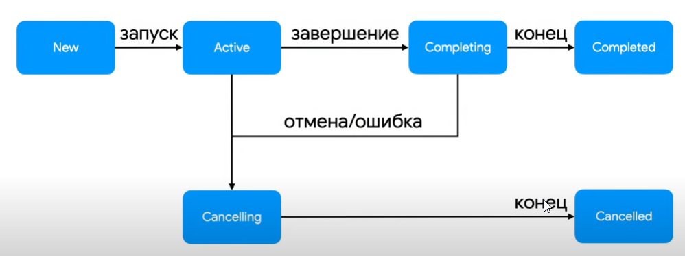

# Job

То, что мы получем при создании launch

### Жизненный цикл Job


---

В случае если job падает, до он забирает с собой всех родителей, а те всех твоих дочерей

для избежания этого можено использовать supervisor job

# Dispatcher 

это поток, на котором корутина выполняется 

есть 4 штуки 

- Default
- Main
- Unconfined
- IO


### Default
Стандартный, используется везде по умолчанию
Сменяет поток выполнений

#### IO
Для IO операций 

>Ввод-вывод (от англ. input/output, I/O) в информатике — взаимодействие между обработчиком информации (например, компьютером) и внешним миром.
>
>Ввод — сигнал или данные, полученные системой.
Вывод — сигнал или данные, посланные ею (или из неё).

Не нагружает сильно систему

#### Main
по умолчанию не определен

для главного потока 

#### Unconfined
изначально не требует какго либо потока
занимает поток, в котором создался и запустился


---
желательно создать обертку и засунуть ее в Di, а потом уже использовать 
---

```kotlin
class AppDispatchers(
    val main: MainCoroutineDispatcher = Dispatchers.Main,
    val default: Coroutine Dispatcher = Dispatchers.Default,
    val io: CoroutineDispatcher = Dispatchers.IO,
    val unconfined: Coroutine Dispatcher = Dispatchers.Unconfined,
)
class ViewModel @Inject constructor(dispatchers: AppDispatchers)
```

---

### CoroutineName 

полезная фича, позволяет легче следить за корутинами 
