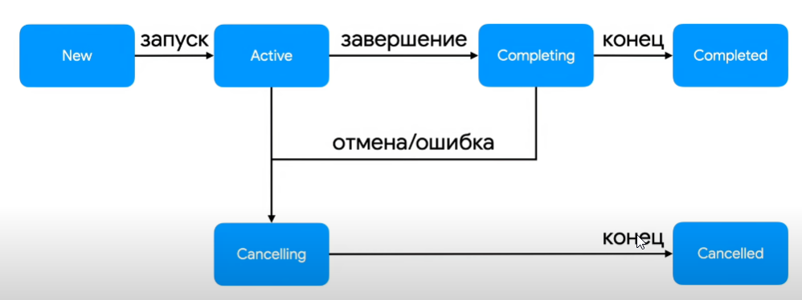

# Job

[источник](https://metanit.com/kotlin/tutorial/8.3.php)

Для того, чтоб запускать корутины, нам нужно их как-то собирать

Делать это можно с помощью `launch`
`launch`, как правило, применяется, когда нам не нужно возвращать результат из корутины и когда мы хотим выполнить ее параллельно 

`launch` возвращает объект `Job`, с помощью которого можно управлять корутиной 

```kotlin
val job: Job = launch{
    println("Some coroutin")
    delay(400L)
}
```

К примеру есть метод join(), который позволяет дождаться окончания корутины

Пример
```kotlin
import kotlinx.coroutines.*
 
suspend fun main() = coroutineScope{
 
    val job = launch{
        for(i in 1..5){
            println(i)
            delay(400L)
        }
    }
 
    println("Start")
    job.join() // ожидаем завершения корутины
    println("End")
}
```

Вывод
```
Start
1
2
3
4
5
End
```

### Свойства Job

Их всего 3 штуки:
- **isActive**
- **isCancelled**
- **isCompleted**

### Жизненный цикл Job


---

В случае если job падает, то он забирает с собой всех родителей, а так же всех своих дочерей

для избежания этого можно использовать supervisor job
