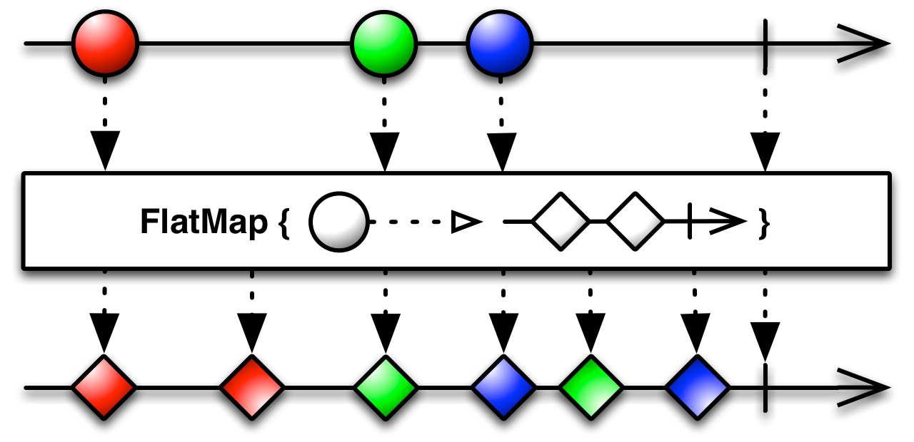

# flatMap

Возвращает новый Observable, который может содержать что угодно 
Нужен для тех случаев, когда нужно вернуть измененный тип данных и нам не важен порядок

Обрабатывает данные не в том порядке, что они были изнчально, к примеру алфавитынй порядок, отданный ему, собъется



```kotlin
val disposable: Disposable = Observable.just("First item", "Second item", "Third item")
        .flatMap(
          // предствим, что метод достаточно нагружен для того, чтоб flatMap мог ожидать выполнение некоторых потоков дольше, чем других, из-за чего и будет происходить разброс в порядке выдачи
          Observable.just(it + " мегакрутой")
        )
        .subscribe({
          println(it)
        }, {
          
        })
``` 

Вывод:

Second item мегакрутой
First item мегакрутой
Third item мегакрутой