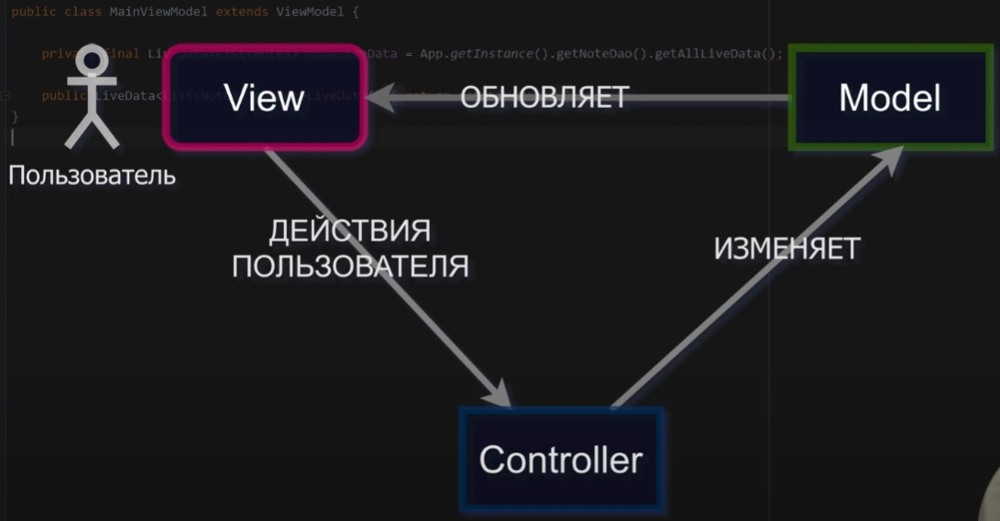

# Model View Controller

Прародитель всех остальных паттернов, по типу MVVM MVP MVi.

Сейчас мало используется

Вся суть точно показана на картинке

Действия пользователя обрабатывает контроллер, который изменяет модель, за которой следит View
И вы этом цикле бытия живет и радуется весь паттерн MVC