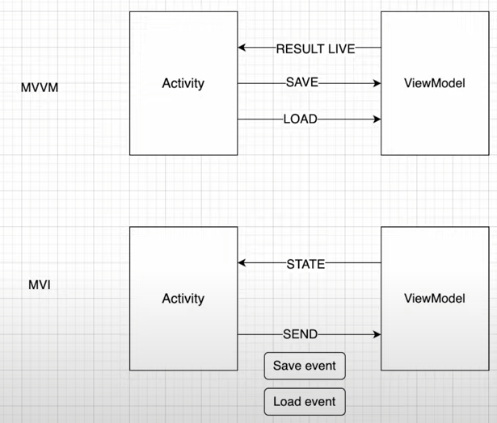

# Model View Intent

Очень похожа на MVVM, но следует одному принципу: _**один вход, один выход**_:

- Имеется один публичный метод на _**отправку данных**_
- Имеется один публичный метод на _**получение данных**_

Суть в том, что имеется один объект, называемый **STATE**, в котром содержиться вся информация для activity. А также всего один метод, в который можно отправлять различные ивенты.

Пример:

### Полезные фичи:

- можно храить лист STATE-ов, после чего отменять какое-либо состояние на нажатие клавиши (Ctrl+Z)

- Можно в листе STATE-ов сравнивать текущее и прошлое стостояние и, если они отличаются, производить какие-то действия (проверка хочет ил пользователь сохранить данные )