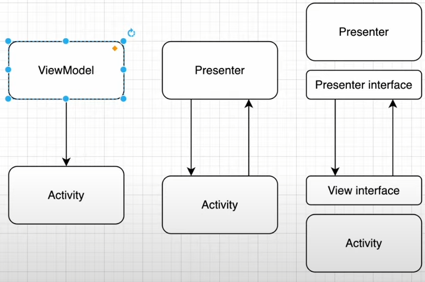

# Model View Presenter

Паттерн, который имеет общие концепции с MVVM, но мало похож на него

**Основыное его отличие** - Activity **знает** о Presenter( ViewModel в MVVM )
Для скрытия публичных методов в общении между Activity и Presenter можно использовать интерфейсы

### Минусы:

- Для сохранения состояния при перевороте нужно использовать сторонние библиотеки 