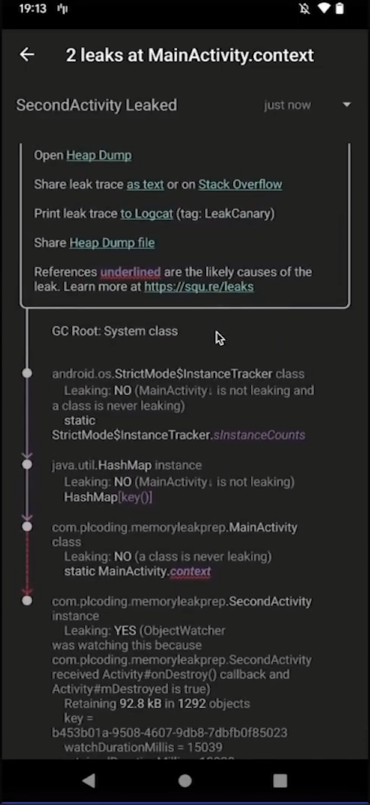

# Leak Canary

[источник](https://www.youtube.com/watch?v=VvkRe9vP5Oc)

Либа, которая помогает искать утечки памяти в проекте 

Запускается фоновым приложением, дампит кучу, проверяет объекты, выводит связи объектов, показывает объекты, которе являются причиной утечки.

**Пример экрана**
